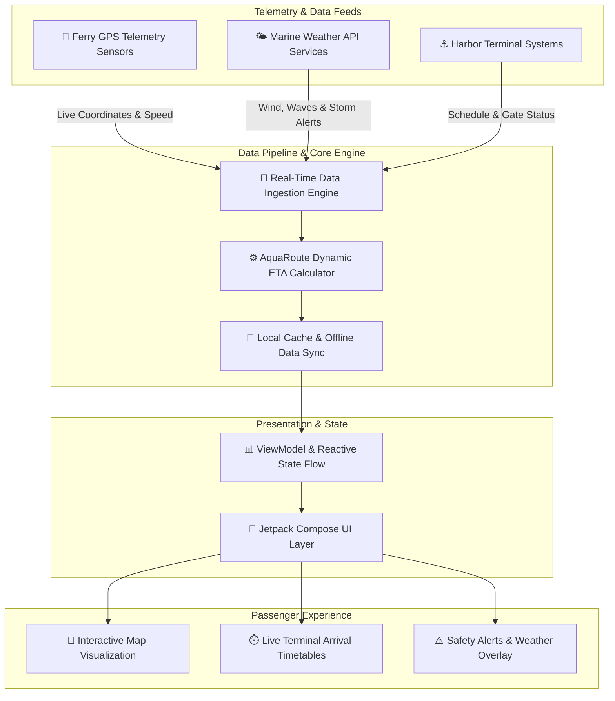

<div align="center">

  <h1>⚓ AquaRoute System</h1>
  <p><strong>Next-Generation Real-Time Water Transportation Tracking & Dynamic ETA Platform</strong></p>

  <p>
    <a href="https://github.com/ImRoniel/AquaRoute-System-app/stargazers"></a>
    <a href="https://github.com/ImRoniel/AquaRoute-System-app/network/members"></a>
    <a href="https://github.com/ImRoniel/AquaRoute-System-app/issues"></a>
    <a href="https://github.com/ImRoniel/AquaRoute-System-app/blob/main/LICENSE"></a>
  </p>

  <p>
    
    
    
    
    
  </p>

</div>

---

## 📖 Overview

**AquaRoute** is an open-source, real-time ferry tracking and ETA system designed to modernize maritime passenger transport. By synthesizing vessel telemetry, dynamic arrival estimation algorithms, status monitoring, and real-time weather overlays, AquaRoute presents commuters and harbor operators with a centralized, data-driven decision platform.

Navigating water transportation often suffers from unpredictable delays, sparse tracking information, and adverse weather conditions. AquaRoute bridges this gap with an intuitive, map-centric mobile interface built natively for Android using state-of-the-art UI and reactive state architectures.

> [!NOTE]
> **AquaRoute** is engineered targeting **Android 14 (API Level 34)** with backward compatibility extending down to **Android 5.0 (API Level 21)**, powered by **Jetpack Compose** and **Kotlin Coroutines**.

---

## ✨ Key Features

<table>
  <tr>
    <td width="50%">
      <h3>📍 Real-Time Vessel Telemetry</h3>
      <p>Continuous geospatial mapping of ferry locations, trajectories, heading directions, and live transit speeds across active water corridors.</p>
    </td>
    <td width="50%">
      <h3>⏱️ Dynamic ETA Calculation Engine</h3>
      <p>Adaptive arrival estimation accounting for live vessel velocity, marine traffic, dock congestion, and historical route performance.</p>
    </td>
  </tr>
  <tr>
    <td width="50%">
      <h3>🌤️ Live Weather & Marine Overlays</h3>
      <p>Integrated meteorological and water condition overlays detailing wind velocity, wave height, tide levels, and visibility alerts.</p>
    </td>
    <td width="50%">
      <h3>📢 Instant Status & Delay Alerts</h3>
      <p>Real-time notifications regarding vessel maintenance, terminal delays, route changes, emergency cancellations, and boarding alerts.</p>
    </td>
  </tr>
  <tr>
    <td width="50%">
      <h3>🎨 Modern Jetpack Compose UI</h3>
      <p>Designed with Material 3 principles featuring fluid micro-animations, customizable dark/light themes, and responsive layout scaling.</p>
    </td>
    <td width="50%">
      <h3>📡 Low-Bandwidth & Offline Resilience</h3>
      <p>Smart local caching strategies that keep terminal timetables, harbor maps, and critical route info accessible under poor connectivity.</p>
    </td>
  </tr>
</table>

---

## 🛠️ Tech Stack

### 📱 Mobile Application Core
* **Language:** [Kotlin 1.9.0](https://kotlinlang.org/)
* **Target SDK:** Android 14 (API Level 34)
* **Min SDK:** Android 5.0 (API Level 21)
* **UI Framework:** [Jetpack Compose](https://developer.android.com/jetpack/compose) (BOM `2023.03.00`)
* **Design System:** Material Design 3 (`androidx.compose.material3`)

### ⚡ Architecture & Reactive Runtime
* **Asynchronous Engine:** Kotlin Coroutines & Flow
* **Core KTX:** `androidx.core:core-ktx:1.12.0`
* **Lifecycle Management:** `androidx.lifecycle:lifecycle-runtime-ktx:2.6.2`
* **Activity Layer:** `androidx.activity:activity-compose:1.8.2`

### 🏗️ Build & Quality Assurance
* **Build System:** Gradle 8.5 with Android Gradle Plugin (AGP) 8.1.4
* **Unit Testing:** JUnit 4 (`4.13.2`)
* **UI & Integration Testing:** Espresso (`3.5.1`) & Compose UI Test (`androidx.compose.ui:ui-test-junit4`)

---

## 🏗️ Architecture & Data Flow

AquaRoute follows a modern, unidirectional data flow (UDF) architecture leveraging Jetpack Compose, ViewModel state management, and real-time telemetry providers:



---

## 🚀 Getting Started

Follow these steps to set up the development environment, build, and run **AquaRoute** on your local machine or emulator.

### 📋 Prerequisites

Ensure your environment meets the following requirements:
* **JDK:** Java Development Kit 17 or JDK 11 (configured for Gradle 8.5)
* **Android Studio:** Android Studio Hedgehog (2023.1.1) or newer
* **Android SDK:** API Level 34 installed via SDK Manager
* **Device / Emulator:** Android 5.0 (Lollipop) or higher (API 21+)
* **Build Tool:** Git 2.x+

---

### 📥 Installation & Setup

1. **Clone the Repository:**
   ```bash
   git clone https://github.com/ImRoniel/AquaRoute-System-app.git
   cd AquaRoute-System-app
   ```

2. **Configure Local Environment Settings:**
   Ensure `local.properties` exists in the project root directory and points to your local Android SDK installation:
   ```properties
   sdk.dir=C\:\\Users\\<YourUsername>\\AppData\\Local\\Android\\Sdk
   ```

> [!TIP]
> On macOS or Linux systems, your `sdk.dir` typically defaults to `/Users/<YourUsername>/Library/Android/sdk` or `/home/<YourUsername>/Android/Sdk`.

---

### ⚙️ Environment Configuration

If integrating third-party map or weather services, create or update `local.properties` or environment variables:

```properties
# System Properties Setup (Optional / Extensible)
MAPS_API_KEY=your_google_maps_api_key_here
WEATHER_API_KEY=your_weather_api_key_here
AQUAROUTE_SERVER_URL=https://api.aquaroute.internal
```

---

### 🏃 Running the Application

#### Using Gradle CLI:

* **Build Debug APK:**
  ```bash
  ./gradlew assembleDebug
  ```
  *(The compiled APK will be located at `app/build/outputs/apk/debug/app-debug.apk`)*

* **Run Unit Tests:**
  ```bash
  ./gradlew test
  ```

* **Run Android Instrumentation & UI Tests:**
  ```bash
  ./gradlew connectedCheck
  ```

#### Using Android Studio:
1. Open Android Studio and select **Open an Existing Project**.
2. Select the `AquaRoute-System-app` directory.
3. Allow Gradle to synchronize dependencies.
4. Select `app` in the run configurations dropdown, choose an emulator or connected target device, and press **Run (Shift + F10)**.

---

## 📂 Project Structure

```text
AquaRoute-System-app/
├── app/                            # Primary Android Application Module
│   ├── build.gradle                # Application dependencies, SDK targets, & Compose configs
│   ├── proguard-rules.pro          # ProGuard rules for release builds
│   └── src/
│       ├── main/
│       │   ├── AndroidManifest.xml # App components, permissions, & activity declarations
│       │   ├── kotlin/com/aquaroute/
│       │   │   ├── MainActivity.kt # Entry point Activity hosting Jetpack Compose UI
│       │   │   └── ui/             # Composable UI components, screens, & theme rules
│       │   └── res/                # Drawables, mipmaps, strings, & XML resources
│       ├── test/                   # JVM Unit Tests (JUnit 4)
│       └── androidTest/            # Instrumentation Tests (Espresso & Compose UI Test)
├── gradle/                         # Gradle Wrapper executables & configuration
│   └── wrapper/
│       ├── gradle-wrapper.jar
│       └── gradle-wrapper.properties
├── .gitignore                      # Git ignore patterns for Android/Gradle builds
├── build.gradle                    # Top-level build configuration & plugin declarations
├── gradle.properties               # Global JVM memory options & AndroidX flags
├── gradlew                         # Shell script for Gradle Wrapper (macOS/Linux)
├── gradlew.bat                     # Batch script for Gradle Wrapper (Windows)
├── settings.gradle                 # Module declarations and plugin repository configuration
├── LICENSE                         # Official MIT License terms
└── README.md                       # Master project documentation
```

---

## 🤝 Contributing

Contributions to **AquaRoute** are warmly welcomed! Whether you are reporting bugs, improving dynamic ETA algorithms, enhancing Jetpack Compose views, or suggesting new features:

1. **Fork the Repository** on GitHub.
2. **Create a Feature Branch:**
   ```bash
   git checkout -b feature/amazing-feature
   ```
3. **Commit your Changes:**
   ```bash
   git commit -m "feat: Add dynamic wave height overlay to map screen"
   ```
4. **Push to the Branch:**
   ```bash
   git push origin feature/amazing-feature
   ```
5. **Open a Pull Request** describing your proposed changes and reference any related issues.

---

## 📜 License

Distributed under the **MIT License**.

```text
MIT License

Copyright (c) 2026 Roniel C. Carbon

Permission is hereby granted, free of charge, to any person obtaining a copy
of this software and associated documentation files (the "Software"), to deal
in the Software without restriction, including without limitation the rights
to use, copy, modify, merge, publish, distribute, sublicense, and/or sell
copies of the Software, and to permit persons to whom the Software is
furnished to do so, subject to the following conditions:

The above copyright notice and this permission notice shall be included in all
copies or substantial portions of the Software.
```

For full details, please refer to the [LICENSE](LICENSE) file.

---

<div align="center">
  <sub>Built with ❤️ by <a href="https://github.com/ImRoniel">Roniel C. Carbon</a> & the open-source community.</sub>
</div>
